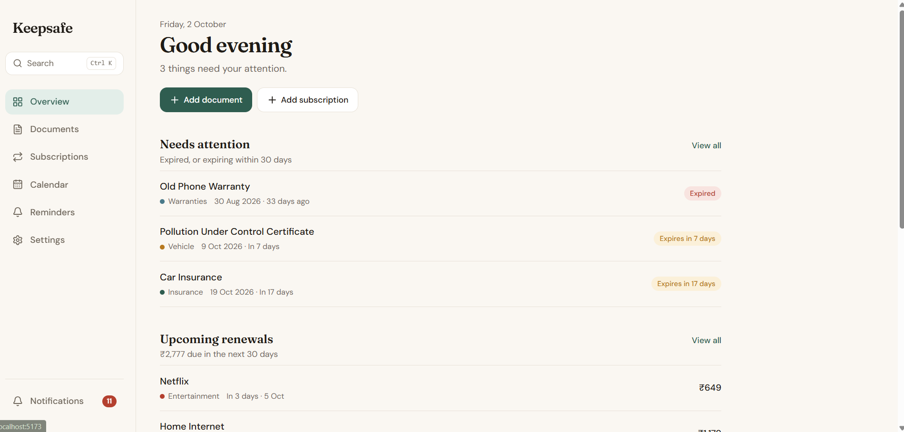
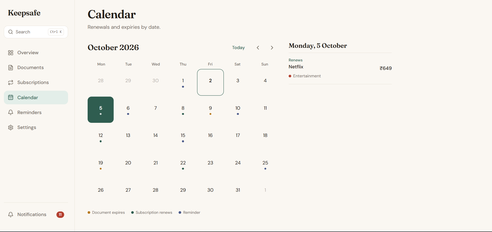
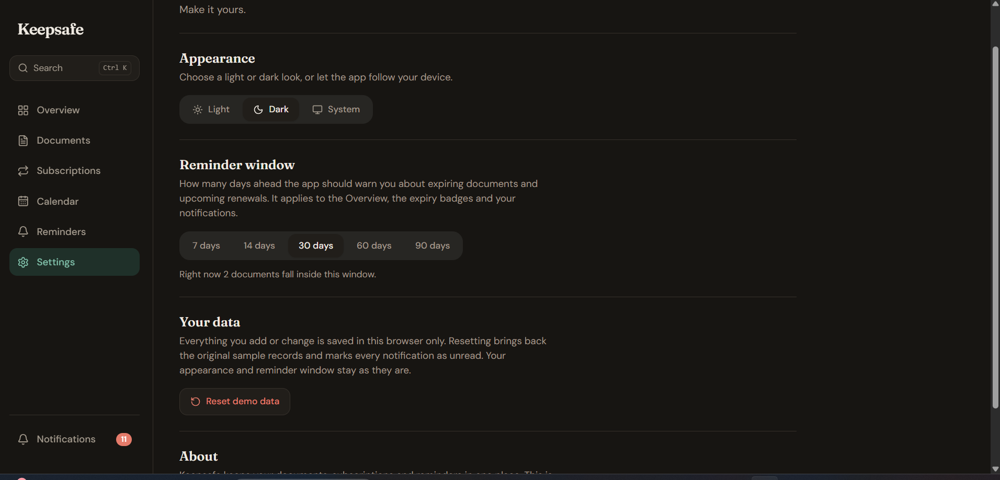

# KeepSafe — Personal Document & Subscription Manager

A modern web app for keeping important documents, subscriptions, renewals, warranties and reminders in one place. Built as a frontend assignment with React, Vite and Redux Toolkit, using dummy JSON data and a mock API layer (no backend).

**Live demo:** https://document-manager-smoky.vercel.app
**Repository:** https://github.com/Chandu3k/Document

## Screenshots

| Overview | Calendar |
| --- | --- |
|  |  |

| Mobile | Dark mode |
| --- | --- |
|  |  |

---

## Features

### Core
- **Overview** — expiring soon, recently added, upcoming renewals, active subscriptions and monthly cost at a glance.
- **Documents** — add, edit, archive, restore and delete records with title, category, issue date, expiry date, notes and category-specific metadata.
- **Document Details** — full record view with all metadata and actions.
- **Subscriptions** — name, category, billing cycle (monthly / quarterly / yearly), amount, next billing date and status (active / paused / cancelled).
- **Subscription Details** — full view with edit, archive, restore and delete.
- **Calendar** — month grid with dots for expiries, renewals and reminders. Selecting a date lists everything happening that day. Recurring subscriptions repeat on the calendar automatically.
- **Reminders** — add, edit, complete and delete reminders.
- **Search & Filters** — search plus category, status, expiry period and type filters that work together and update instantly.
- **Settings** — theme and reminder lead time.

### Bonus
- Dark mode
- Notification center (follows the reminder lead-time setting)
- Command palette (`Ctrl + K`)
- Keyboard-friendly UI with visible focus states and reduced-motion support
- Responsive mobile layout with bottom navigation
- Mock API layer with simulated latency and a testable error state
- Recurring subscription calculations (monthly equivalent, repeating billing dates)
- Loading skeletons, error states with retry, and empty states

---

## Tech Stack

| Area | Choice |
| --- | --- |
| UI | React 19 + Vite |
| State | Redux Toolkit |
| Routing | React Router |
| Styling | Tailwind CSS |
| Dates | date-fns |
| Icons | lucide-react |

---

## Getting Started

```bash
git clone https://github.com/Chandu3k/Document.git
cd Document
npm install
npm run dev
```

Other scripts:

```bash
npm run build    # production build
npm run preview  # preview the production build
npm run lint     # lint the code
```

---

## Project Structure

```
src/
├── api/          # Mock API layer (swap for real fetch calls later)
├── components/   # Reusable UI (forms, layout, empty states, skeletons...)
├── data/         # Dummy JSON: documents, subscriptions, categories, reminders
├── pages/        # Overview, Documents, Subscriptions, Calendar, Reminders, Settings...
├── store/        # Redux slices and selectors
└── utils/        # Date helpers, event builder, formatters
```

---

## State Management

Redux Toolkit holds the state that is shared across screens:

- documents, subscriptions, reminders, categories
- search and filters
- selected calendar date
- user preferences (theme, reminder lead time)
- notifications (read state)

Local UI state, such as whether a modal or dropdown is open, stays inside components.

**Derived data is never stored.** "Expiring soon", upcoming renewals, monthly total, filtered results, calendar events and notifications are all computed with selectors from the base data. Because of this, editing a subscription instantly updates the Overview, Calendar, Subscriptions list and notifications.

---

## Replacing the Mock API

All data access goes through `src/api/index.js`, which currently reads the JSON files in `src/data/` after a short simulated delay. To connect a real backend, replace the functions in that file with `fetch` calls. The Redux slices and screens don't need to change.

### Testing error states
In the browser console, run:

```js
localStorage.setItem('keepsafe:fail', '1')
```

and refresh to simulate a network failure. Remove it with `localStorage.removeItem('keepsafe:fail')`.

---

## Deployment

Deployed on Vercel. `vercel.json` rewrites all routes to `index.html` so React Router works on refresh.

---

## Possible Improvements

- Persist data in LocalStorage
- File preview with dummy files
- Drag-and-drop document organization